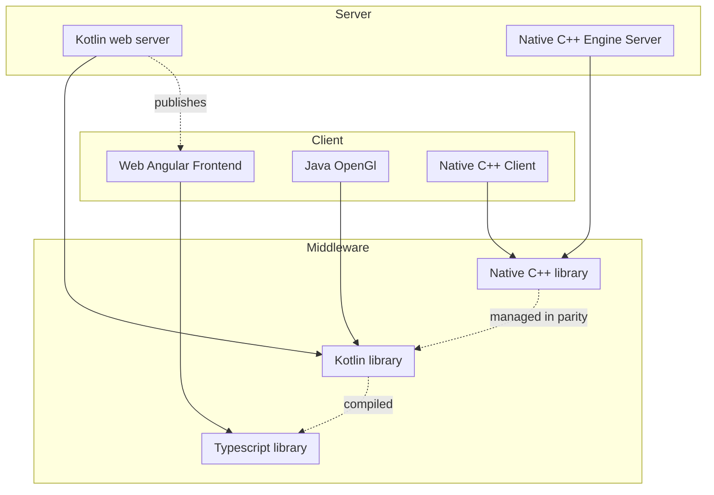

# Web game engine

## System dependency graph

```mermaid
flowchart
    subgraph Server[Server]
        subgraph native_server [Native C++ Engine Server]
        end
        subgraph web_server [Kotlin web server]
        end
    end

    subgraph Middleware[Middleware]
        subgraph web_library [Typescript library]
        end
        subgraph kotlin_library [Kotlin library]
        end
        subgraph native_library [Native C++ library]
        end
        native_library-.managed in parity.->kotlin_library
        kotlin_library-.compiled.->web_library
    end
    
    subgraph client[Client]
        subgraph native_client [Native C++ Client]
        end
        subgraph java_client [Java OpenGl]
        end
        subgraph web_client [Web Angular Frontend]
        end
    end
    
    native_client-->native_library
    native_server-->native_library

    web_client-->web_library
    web_server-->kotlin_library
    
    java_client-->kotlin_library
    
    web_server-.publishes.->web_client
```